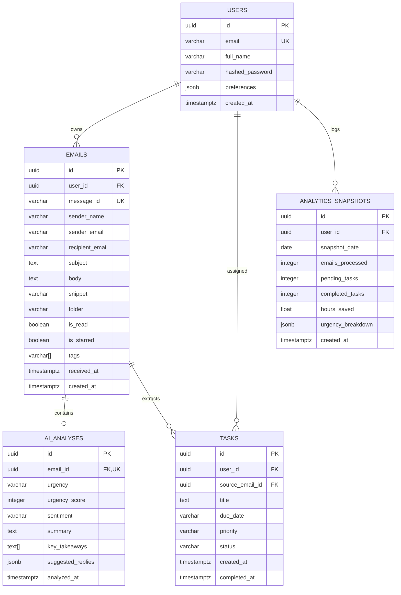

# SiftMail — PostgreSQL Database Design & Architecture

---

## 1. PostgreSQL Relational Architecture

The persistence layer is powered by **PostgreSQL 16**, leveraging native UUID generation, JSONB columns for dynamic LLM structures, and foreign key cascading.



---

## 2. PostgreSQL DDL (Data Definition Language)

```sql
-- Enable UUID extension
CREATE EXTENSION IF NOT EXISTS "uuid-ossp";

-- 1. Users Table
CREATE TABLE users (
    id UUID PRIMARY KEY DEFAULT uuid_generate_v4(),
    email VARCHAR(255) NOT NULL UNIQUE,
    full_name VARCHAR(128) NOT NULL,
    hashed_password VARCHAR(255) NOT NULL,
    preferences JSONB DEFAULT '{"theme": "dark", "auto_sift": true}'::jsonb,
    created_at TIMESTAMPTZ NOT NULL DEFAULT NOW(),
    updated_at TIMESTAMPTZ NOT NULL DEFAULT NOW()
);

-- 2. Emails Table
CREATE TABLE emails (
    id UUID PRIMARY KEY DEFAULT uuid_generate_v4(),
    user_id UUID NOT NULL REFERENCES users(id) ON DELETE CASCADE,
    message_id VARCHAR(255) UNIQUE,
    sender_name VARCHAR(128) NOT NULL,
    sender_email VARCHAR(255) NOT NULL,
    recipient_email VARCHAR(255) NOT NULL,
    subject TEXT NOT NULL,
    body TEXT NOT NULL,
    snippet VARCHAR(300) NOT NULL,
    folder VARCHAR(32) NOT NULL DEFAULT 'inbox',
    is_read BOOLEAN NOT NULL DEFAULT FALSE,
    is_starred BOOLEAN NOT NULL DEFAULT FALSE,
    tags TEXT[] NOT NULL DEFAULT ARRAY[]::TEXT[],
    received_at TIMESTAMPTZ NOT NULL,
    created_at TIMESTAMPTZ NOT NULL DEFAULT NOW()
);

-- 3. AI Analysis Table
CREATE TABLE ai_analyses (
    id UUID PRIMARY KEY DEFAULT uuid_generate_v4(),
    email_id UUID NOT NULL UNIQUE REFERENCES emails(id) ON DELETE CASCADE,
    urgency VARCHAR(16) NOT NULL CHECK (urgency IN ('low', 'medium', 'high', 'critical')),
    urgency_score INTEGER NOT NULL CHECK (urgency_score BETWEEN 0 AND 100),
    sentiment VARCHAR(32) NOT NULL,
    summary TEXT NOT NULL,
    key_takeaways TEXT[] NOT NULL DEFAULT ARRAY[]::TEXT[],
    suggested_replies JSONB NOT NULL DEFAULT '[]'::jsonb,
    analyzed_at TIMESTAMPTZ NOT NULL DEFAULT NOW()
);

-- 4. Tasks Table
CREATE TABLE tasks (
    id UUID PRIMARY KEY DEFAULT uuid_generate_v4(),
    user_id UUID NOT NULL REFERENCES users(id) ON DELETE CASCADE,
    source_email_id UUID REFERENCES emails(id) ON DELETE SET NULL,
    title TEXT NOT NULL,
    due_date VARCHAR(64),
    priority VARCHAR(16) NOT NULL DEFAULT 'medium' CHECK (priority IN ('low', 'medium', 'high', 'urgent')),
    status VARCHAR(16) NOT NULL DEFAULT 'pending' CHECK (status IN ('pending', 'in_progress', 'completed')),
    created_at TIMESTAMPTZ NOT NULL DEFAULT NOW(),
    completed_at TIMESTAMPTZ
);

-- 5. Analytics Snapshots Table
CREATE TABLE analytics_snapshots (
    id UUID PRIMARY KEY DEFAULT uuid_generate_v4(),
    user_id UUID NOT NULL REFERENCES users(id) ON DELETE CASCADE,
    snapshot_date DATE NOT NULL,
    emails_processed INTEGER NOT NULL DEFAULT 0,
    pending_tasks INTEGER NOT NULL DEFAULT 0,
    completed_tasks INTEGER NOT NULL DEFAULT 0,
    hours_saved NUMERIC(5,2) NOT NULL DEFAULT 0.00,
    urgency_breakdown JSONB NOT NULL DEFAULT '{"critical": 0, "high": 0, "medium": 0, "low": 0}'::jsonb,
    created_at TIMESTAMPTZ NOT NULL DEFAULT NOW(),
    CONSTRAINT uq_user_snapshot_date UNIQUE (user_id, snapshot_date)
);
```

---

## 3. High-Performance Indexing Strategy

```sql
-- Fast inbox retrieval by folder, read status, and arrival date
CREATE INDEX idx_emails_user_folder_date ON emails (user_id, folder, received_at DESC);
CREATE INDEX idx_emails_unread ON emails (user_id, is_read) WHERE is_read = FALSE;

-- Fast join for AI analysis per email
CREATE INDEX idx_ai_analyses_email_id ON ai_analyses (email_id);

-- Fast Kanban retrieval by status and priority
CREATE INDEX idx_tasks_user_status ON tasks (user_id, status, priority);

-- Full text search indexing on email subjects & bodies
CREATE INDEX idx_emails_fts ON emails USING GIN (to_tsvector('english', subject || ' ' || body));
```
