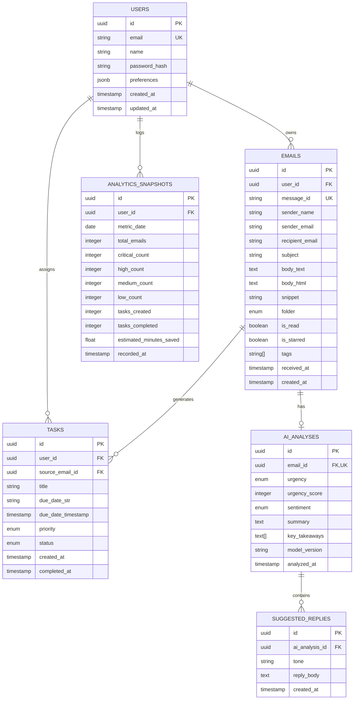

# SiftMail — Database Design & Data Architecture

---

## 1. Entity Relationship (ER) Diagram



---

## 2. Table Schemas & Data Dictionaries

### 2.1 Table: `users`
| Column | Type | Constraints | Description |
| :--- | :--- | :--- | :--- |
| `id` | `UUID` | `PRIMARY KEY, DEFAULT gen_random_uuid()` | Unique user identifier |
| `email` | `VARCHAR(255)` | `NOT NULL, UNIQUE` | User login email address |
| `name` | `VARCHAR(128)` | `NOT NULL` | User full name |
| `password_hash` | `VARCHAR(255)` | `NOT NULL` | Bcrypt hashed password |
| `preferences` | `JSONB` | `DEFAULT '{}'` | User UI/AI preferences (default tone, auto-sift) |
| `created_at` | `TIMESTAMPTZ` | `DEFAULT NOW()` | Account creation timestamp |

### 2.2 Table: `emails`
| Column | Type | Constraints | Description |
| :--- | :--- | :--- | :--- |
| `id` | `UUID` | `PRIMARY KEY, DEFAULT gen_random_uuid()` | SiftMail internal email ID |
| `user_id` | `UUID` | `NOT NULL, REFERENCES users(id) ON DELETE CASCADE` | Owner user ID |
| `message_id` | `VARCHAR(255)` | `NULLABLE, UNIQUE` | Provider RFC 822 Message-ID |
| `sender_name` | `VARCHAR(128)` | `NOT NULL` | Sender display name |
| `sender_email` | `VARCHAR(255)` | `NOT NULL` | Sender email address |
| `recipient_email`| `VARCHAR(255)` | `NOT NULL` | Recipient email address |
| `subject` | `TEXT` | `NOT NULL` | Email subject line |
| `body_text` | `TEXT` | `NOT NULL` | Stripped plaintext content |
| `snippet` | `VARCHAR(300)` | `NOT NULL` | Preview snippet for list views |
| `folder` | `VARCHAR(32)` | `DEFAULT 'inbox'` | `inbox`, `sent`, `starred`, `archive`, `trash` |
| `is_read` | `BOOLEAN` | `DEFAULT FALSE` | Read status |
| `is_starred` | `BOOLEAN` | `DEFAULT FALSE` | Starred bookmark flag |
| `tags` | `TEXT[]` | `DEFAULT ARRAY[]::TEXT[]` | Categorical tags |
| `received_at` | `TIMESTAMPTZ` | `NOT NULL` | When message arrived |

### 2.3 Table: `ai_analyses`
| Column | Type | Constraints | Description |
| :--- | :--- | :--- | :--- |
| `id` | `UUID` | `PRIMARY KEY, DEFAULT gen_random_uuid()` | Analysis record ID |
| `email_id` | `UUID` | `NOT NULL, UNIQUE, REFERENCES emails(id) ON DELETE CASCADE` | One-to-one link to email |
| `urgency` | `VARCHAR(16)` | `NOT NULL` | `low`, `medium`, `high`, `critical` |
| `urgency_score` | `INTEGER` | `NOT NULL, CHECK (urgency_score BETWEEN 0 AND 100)` | Score 0 to 100 |
| `sentiment` | `VARCHAR(32)` | `NOT NULL` | `positive`, `neutral`, `urgent`, `frustrated`, `inquiry` |
| `summary` | `TEXT` | `NOT NULL` | 2-sentence executive TL;DR |
| `key_takeaways` | `TEXT[]` | `NOT NULL` | Array of key bullet points |
| `analyzed_at` | `TIMESTAMPTZ` | `DEFAULT NOW()` | Timestamp of AI execution |

### 2.4 Table: `tasks`
| Column | Type | Constraints | Description |
| :--- | :--- | :--- | :--- |
| `id` | `UUID` | `PRIMARY KEY, DEFAULT gen_random_uuid()` | Task ID |
| `user_id` | `UUID` | `NOT NULL, REFERENCES users(id) ON DELETE CASCADE` | Assigned user ID |
| `source_email_id`| `UUID` | `NULLABLE, REFERENCES emails(id) ON DELETE SET NULL` | Originating email reference |
| `title` | `TEXT` | `NOT NULL` | Action item description |
| `due_date_str` | `VARCHAR(64)` | `NULLABLE` | Display deadline (e.g. "Today, 2 PM") |
| `priority` | `VARCHAR(16)` | `DEFAULT 'medium'` | `urgent`, `high`, `medium`, `low` |
| `status` | `VARCHAR(16)` | `DEFAULT 'pending'` | `pending`, `in_progress`, `completed` |
| `created_at` | `TIMESTAMPTZ` | `DEFAULT NOW()` | Creation timestamp |
| `completed_at` | `TIMESTAMPTZ` | `NULLABLE` | Completion timestamp |

---

## 3. Indexing Strategy

```sql
-- Fast inbox retrieval by user, folder, and date
CREATE INDEX idx_emails_user_folder_date ON emails (user_id, folder, received_at DESC);

-- Fast lookup for unread count badge
CREATE INDEX idx_emails_user_unread ON emails (user_id, is_read) WHERE is_read = FALSE;

-- Fast join for AI Analysis
CREATE INDEX idx_ai_analysis_email ON ai_analyses (email_id);

-- Fast Kanban query by user and status
CREATE INDEX idx_tasks_user_status ON tasks (user_id, status, priority);
```
