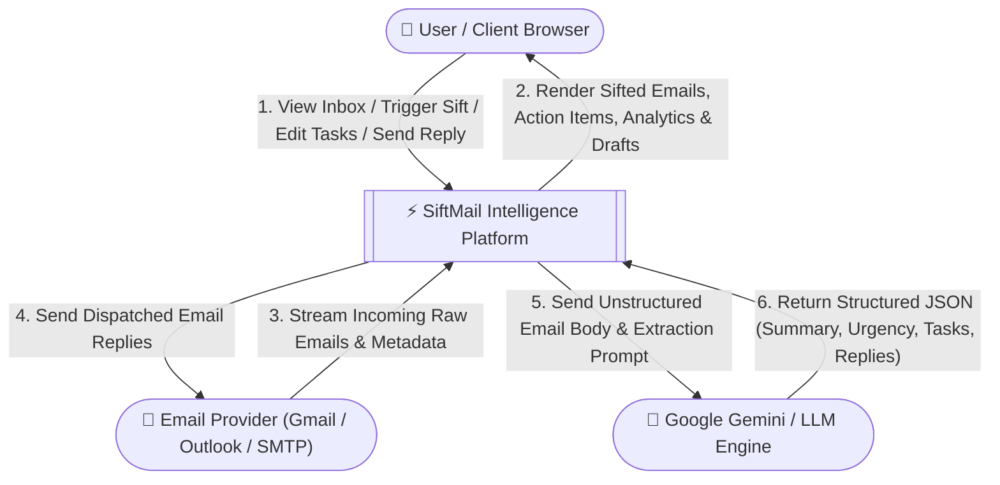
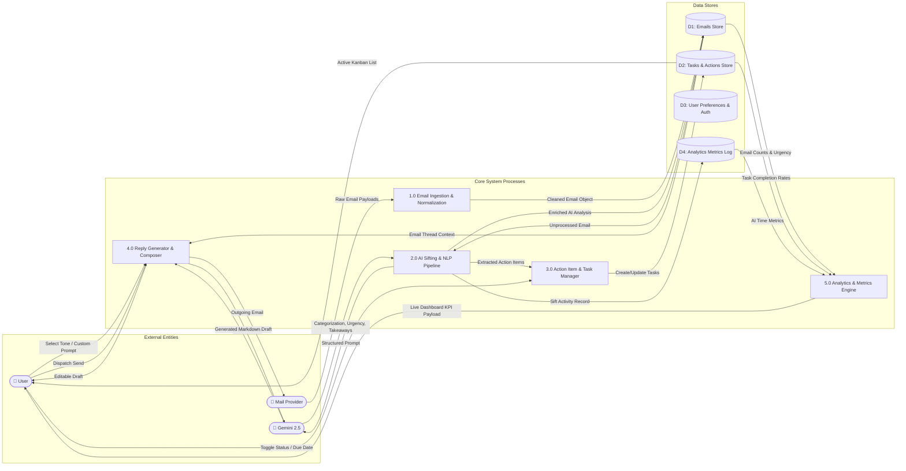
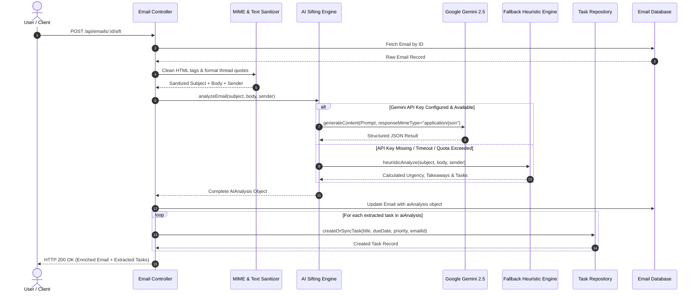

# SiftMail — Data Flow Diagrams (DFD)

---

## 1. Context Diagram (Level 0 DFD)

The Level 0 Context Diagram represents SiftMail as a single unified system interacting with external entities (Users, Email Service Providers, and AI LLM Services).

---

## 2. Level 1 DFD — Subsystem Data Flow

Level 1 breaks down SiftMail into its core internal processes and data stores.

---

## 3. Level 2 DFD — Deep Dive: AI Sifting & Action Item Extraction Pipeline

This diagram illustrates the precise step-by-step data transformation when an email is sifted by the AI engine.

---

## 4. Data Dictionary (Key Flows)

| Flow Name | Source | Destination | Data Elements |
| :--- | :--- | :--- | :--- |
| `Raw Email Payload` | Email Provider / Input | `1.0 Normalizer` | `messageId, from, to, subject, headers, bodyHtml, bodyText, timestamp` |
| `Sanitized Email` | `1.0 Normalizer` | `D1: Emails Store` | `id, sender, senderEmail, subject, body, snippet, isRead, tags, folder` |
| `AI Sift Payload` | `2.0 AI Engine` | `D1 / D2 Stores` | `urgency (low/med/high/critical), urgencyScore (0-100), sentiment, summary, keyTakeaways[], suggestedReplies[], extractedTasks[]` |
| `Task Mutation` | User UI | `3.0 Task Manager` | `taskId, status (pending/in_progress/completed), priority, dueDate, title` |
| `Reply Draft` | `4.0 Reply Generator` | User Composer | `draftText, tone, recipient, subject, customNotes` |
| `Analytics Summary` | `5.0 Analytics Engine` | User Dashboard | `healthScore, emailsProcessed, pendingTasksCount, timeSavedMinutes, urgencyBreakdown, weeklyVolume[]` |
