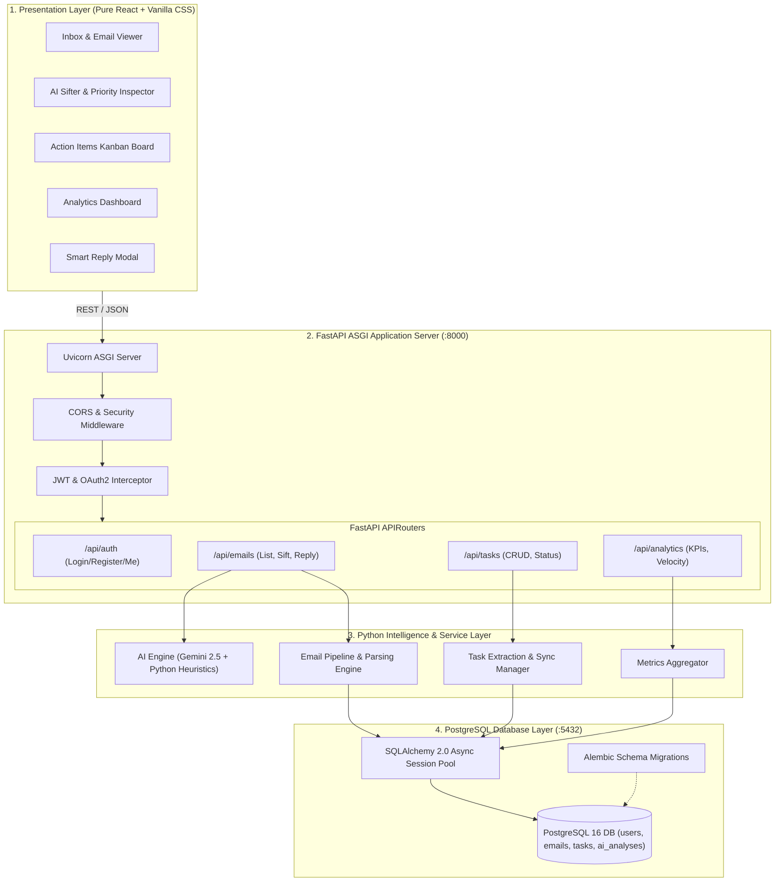

# SiftMail — High-Level Design (HLD)

---

## 1. Architectural Philosophy & Principles
SiftMail is structured as a decoupled, modern three-tier web platform consisting of:
1. **Pure React Presentation Tier**: High-speed, responsive Single Page Application built in Pure React + Vite, communicating exclusively via REST APIs.
2. **Python FastAPI Intelligence Tier**: Asynchronous Python ASGI server handling business logic, email ingestion, NLP extraction, and LLM orchestration.
3. **PostgreSQL Relational Persistence Tier**: ACID-compliant relational data store with JSONB support, indexing, and foreign key integrity.

---

## 2. High-Level Architecture Diagram

---

## 3. Component Deep Dive

### 3.1 Frontend Presentation Tier (Pure React)
- **Framework**: Pure React 18 with Vite.
- **Styling Architecture**: Vanilla CSS using custom CSS properties (`var(--accent-purple)`, `var(--bg-glass)`), providing dark-mode first glassmorphism without heavy third-party CSS dependencies.
- **Key Modules**:
  - `InboxView.jsx`: Thread list, urgency indicators, search bar, and reader.
  - `AISifterView.jsx`: Deep breakdown of AI insights, urgency dials, and key takeaways.
  - `TaskBoardView.jsx`: Interactive 3-column Kanban board (`Pending`, `In Progress`, `Completed`).
  - `AnalyticsView.jsx`: Visual KPI cards and SVG-based velocity trend charts.

### 3.2 Backend Service Tier (Python FastAPI)
- **FastAPI**: Async ASGI application leveraging Python type hints (`pydantic.BaseModel`).
- **AI Service**: Orchestrates Google Gemini 2.5 Flash API calls with fallback to Python heuristic tokenizers and regex extractors.
- **Dependency Injection**: FastAPI `Depends(get_db)` provides per-request async database sessions with automatic rollback on error.

### 3.3 Database Tier (PostgreSQL)
- **PostgreSQL 16**: Houses relational tables (`users`, `emails`, `ai_analyses`, `tasks`, `analytics_snapshots`).
- **JSONB Capabilities**: Stores dynamic AI output arrays (`key_takeaways`, `suggested_replies`) with full JSON querying capabilities.
- **Connection Pooling**: Managed via `asyncpg` driver for maximum concurrent throughput.
