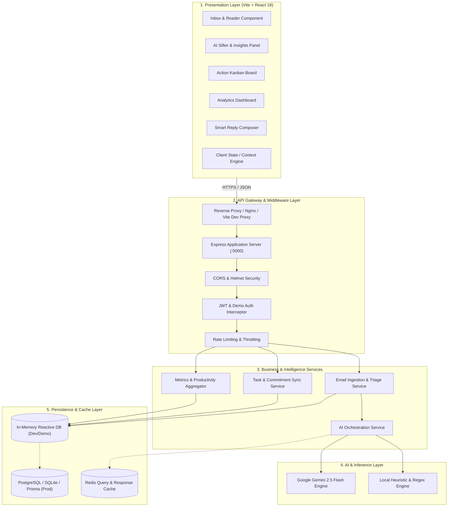
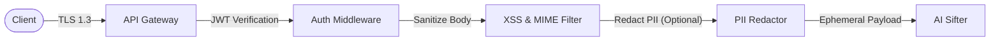

# SiftMail — High-Level Design (HLD)

---

## 1. Architectural Philosophy & Principles
SiftMail is architected on modern cloud-native, modular service principles designed for high throughput, low latency, and zero single-points-of-failure.

### 1.1 Core Architectural Principles
1. **Separation of Concerns**: Clear boundary separation between Presentation (Vite + React SPA), API Gateway / Orchestration (Express.js), AI Worker Services (Gemini / Heuristic Engine), and Persistence.
2. **Resilience & Graceful Degradation**: If external LLM APIs fail or exceed rate limits, the system seamlessly falls back to fast local NLP heuristics without interrupting the user workflow.
3. **Stateless Service Layer**: All API instances are stateless, enabling horizontal scaling behind load balancers.
4. **Reactive Data Sync**: Optimistic UI updates on the frontend paired with idempotent REST mutations on the backend.

---

## 2. System Architecture Diagram



---

## 3. Component Deep Dive

### 3.1 Presentation Layer (Frontend SPA)
- **Vite 5 / React 18 SPA**: Delivered as single-page application with code splitting.
- **Glassmorphic Theme System**: Custom CSS variables providing dark-mode first visual hierarchy, micro-interactions, responsive typography, and glowing priority accents.
- **Modular Component Tree**:
  - `Navbar` & `Sidebar`: Global navigation, unread counters, and folder filtering.
  - `InboxView`: Search, multi-criteria filtering, thread list, and thread detail view.
  - `AISifterView`: Interactive deep inspection with live trigger to re-sift with custom focus.
  - `TaskBoardView`: 3-column Kanban board (`Pending`, `In Progress`, `Completed`) with inline task creation and priority tagging.
  - `AnalyticsView`: Visual KPI cards and SVG-based velocity charts.
  - `ReplyModal`: Multi-tone reply generator with instant copy-to-clipboard or send actions.

### 3.2 Gateway & Routing Layer
- **Express.js Router Modules**:
  - `/api/auth`: User registration, login, and demo session provisioning.
  - `/api/emails`: Inbox CRUD, folder filtering, and AI `/sift` / `/reply` triggers.
  - `/api/tasks`: Action item lifecycle management.
  - `/api/analytics`: Aggregated productivity statistics.
  - `/api/health`: Liveness and readiness probes.

### 3.3 AI Orchestration Layer
- **Unified Interface**: Decouples the rest of the application from specific AI providers.
- **Multi-Engine Pipeline**:
  ```
  Incoming Email Body 
      │
      ▼
  Check GEMINI_API_KEY Configured?
     ├── Yes ──► Send to Gemini 2.5 Flash (Timeout: 3500ms)
     │                │
     │                ├── Success ──► Parse & Return JSON
     │                └── Failure ──► Fallback to Heuristic Engine
     │
     └── No  ───────────────────────► Execute Heuristic Engine
  ```

---

## 4. Scalability, Resiliency & Availability

| Dimension | Strategy | Implementation |
| :--- | :--- | :--- |
| **Horizontal Scaling** | Stateless application tier | Multiple Express worker instances running behind Nginx / Cloudflare Load Balancers. |
| **Caching** | Caching LLM Sifting Results | SHA-256 hash of `email.subject + email.body` cached so identical emails are not re-analyzed. |
| **Database Scaling** | Read Replicas & Connection Pooling | Master-Replica PostgreSQL architecture with PgBouncer connection pooler. |
| **Fault Tolerance** | Dual-Engine Failover | Built-in zero-dependency Heuristic AI guarantees zero downtime even during full external LLM outages. |
| **Backpressure** | Batch Queue Ingestion | High-volume inbox sync handled via BullMQ / Redis queues to throttle AI inference calls. |

---

## 5. Security & Privacy Architecture



1. **Zero-Knowledge Architecture Option**: Only message metadata (subject, sender, stripped body) is passed to the AI engine ephemerally; raw credentials are never logged or exported.
2. **JWT Stateless Auth**: Signed with HMAC SHA-256 using 256-bit environment secrets.
3. **CORS Isolation**: Explicit origin whitelisting blocking unauthorized cross-origin requests.
