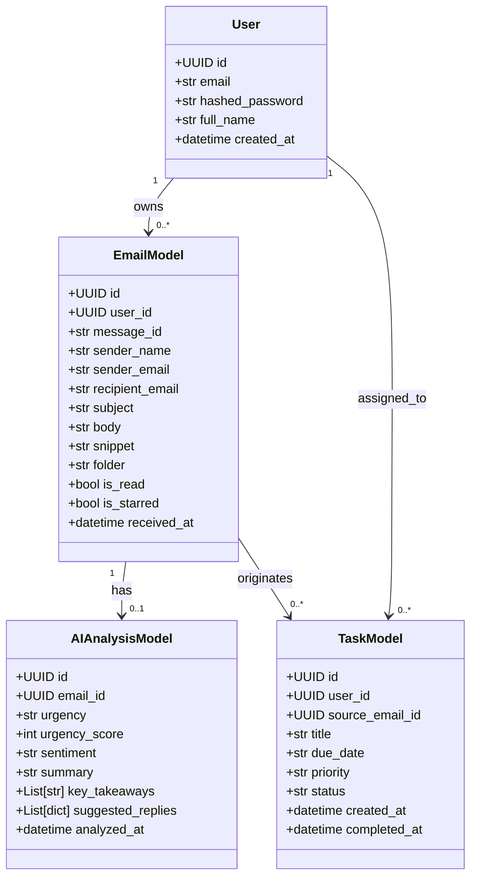
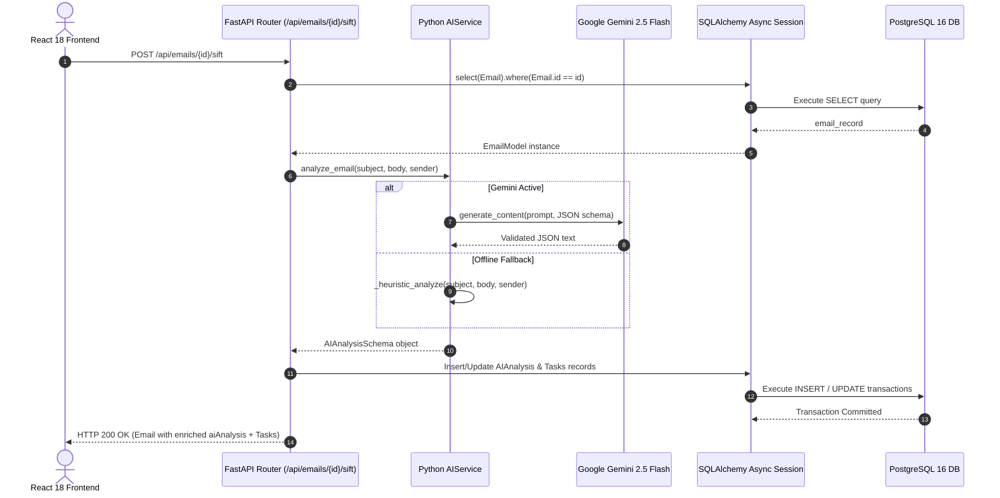

# SiftMail — Low-Level Design (LLD)

---

## 1. Class & Data Models (Python / SQLAlchemy / Pydantic)

### 1.1 SQLAlchemy Database Models (`app/models/`)



---

## 2. Pydantic Schemas (`app/schemas/`)

### 2.1 Pydantic DTOs for AI & Email

```python
from pydantic import BaseModel, EmailStr
from typing import List, Optional
from datetime import datetime
from enum import Enum

class UrgencyLevel(str, Enum):
    LOW = "low"
    MEDIUM = "medium"
    HIGH = "high"
    CRITICAL = "critical"

class TaskStatus(str, Enum):
    PENDING = "pending"
    IN_PROGRESS = "in_progress"
    COMPLETED = "completed"

class SuggestedReply(BaseModel):
    tone: str
    text: str

class ExtractedTaskSchema(BaseModel):
    title: str
    dueDate: Optional[str] = None
    priority: str = "medium"

class AIAnalysisSchema(BaseModel):
    urgency: UrgencyLevel
    urgencyScore: int
    sentiment: str
    summary: str
    keyTakeaways: List[str]
    suggestedReplies: List[SuggestedReply]
    extractedTasks: List[ExtractedTaskSchema]

class EmailResponse(BaseModel):
    id: str
    sender: str
    senderEmail: str
    recipient: str
    subject: str
    body: str
    snippet: str
    folder: str
    isRead: bool
    isStarred: bool
    receivedAt: datetime
    tags: List[str]
    aiAnalysis: Optional[AIAnalysisSchema] = None

class TaskResponse(BaseModel):
    id: str
    title: str
    dueDate: Optional[str]
    priority: str
    status: TaskStatus
    sourceEmailId: Optional[str]
    sourceSubject: Optional[str]
    createdAt: datetime
```

---

## 3. Python Service & Router Architecture

### 3.1 `AIService` Implementation Pattern (`app/services/ai_service.py`)

```python
import os
import json
from app.schemas.ai_schema import AIAnalysisSchema

class AIService:
    @staticmethod
    async def analyze_email(subject: str, body: str, sender: str) -> AIAnalysisSchema:
        api_key = os.getenv("GEMINI_API_KEY")
        if api_key and api_key.strip():
            try:
                # Invoke Google GenAI Gemini 2.5 Flash SDK
                from google import genai
                client = genai.Client(api_key=api_key)
                prompt = f"""Analyze this email and output JSON adhering to the schema:
Sender: {sender}
Subject: {subject}
Body: {body}"""
                response = client.models.generate_content(
                    model="gemini-2.5-flash",
                    contents=prompt,
                    config={"response_mime_type": "application/json"}
                )
                return AIAnalysisSchema.model_validate_json(response.text)
            except Exception as e:
                # Log and trigger graceful fallback
                pass
        
        # Local Python Heuristic Fallback
        return AIService._heuristic_analyze(subject, body, sender)

    @staticmethod
    def _heuristic_analyze(subject: str, body: str, sender: str) -> AIAnalysisSchema:
        # Regex and keyword priority classifier
        ...
```

---

## 4. Sequence Workflows

### 4.1 Sift Email & PostgreSQL Persistence Workflow


