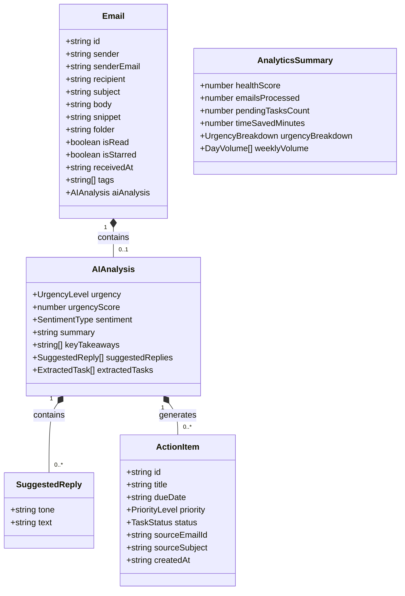
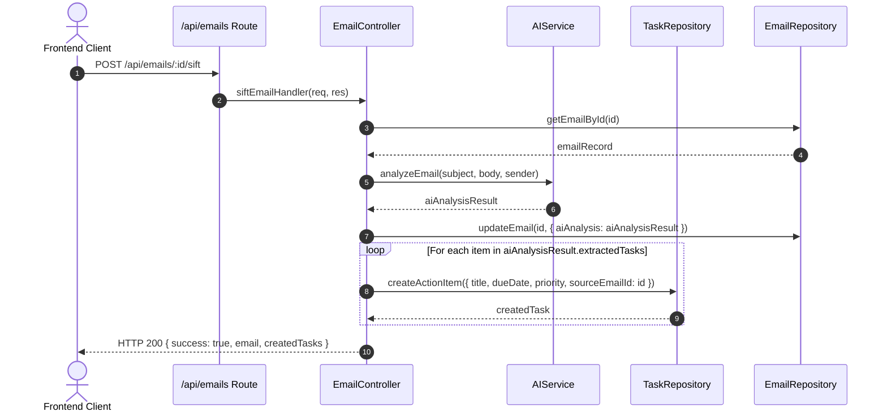
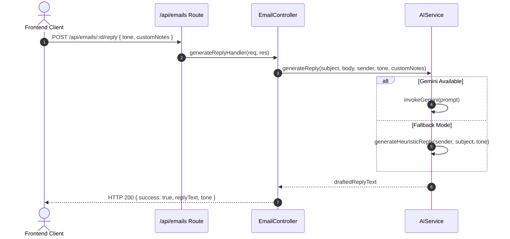

# SiftMail — Low-Level Design (LLD)

---

## 1. Class & Interface Architecture

### 1.1 Core TypeScript Interfaces



---

## 2. Design Patterns Implemented

### 2.1 Strategy Pattern (AI Inference Engine)
The `AIService` encapsulates multiple algorithm strategies (Gemini LLM vs. Heuristic Rule-Based NLP). The calling controller consumes a single invariant method signature `analyzeEmail()` regardless of which underlying engine fulfills the computation.

```
       ┌──────────────────────────────┐
       │      <<interface>>           │
       │     AISiftingStrategy        │
       └──────────────┬───────────────┘
                      │
        ┌─────────────┴─────────────┐
        ▼                           ▼
┌──────────────────┐      ┌──────────────────┐
│  GeminiStrategy  │      │HeuristicStrategy │
│ (External Cloud) │      │  (Local Offline) │
└──────────────────┘      └──────────────────┘
```

### 2.2 Repository Pattern (Data Access Layer)
The controllers do not directly mutate memory arrays or query SQL directly; all operations are routed through standardized data access methods (`findAll`, `findById`, `create`, `update`, `delete`), facilitating seamless transitions from in-memory prototyping to SQLite/PostgreSQL.

### 2.3 Middleware Chain Pattern (Express)
Request flows pass through modular middleware:
`CORS Middleware` ➔ `JSON Body Parser` ➔ `Auth Interceptor` ➔ `Rate Limiter` ➔ `Route Controller` ➔ `Global Error Handler`.

---

## 3. Sequence Diagrams

### 3.1 Email Sifting & Task Auto-Extraction Sequence



### 3.2 Smart Reply Generation Sequence



---

## 4. Module & Method Specifications

### 4.1 `AIService` (`backend/src/services/ai.service.ts`)
- `analyzeEmail(subject: string, body: string, sender: string): Promise<AIAnalysis>`
  - **Input**: Email subject, body string, sender display name/email.
  - **Output**: Fully structured `AIAnalysis` object containing urgency score, sentiment, bullet takeaways, and tasks.
  - **Error Handling**: Catches network/API exceptions and cascades to `heuristicAnalyze()`.

- `generateReply(subject: string, body: string, sender: string, tone: string, customNotes?: string): Promise<string>`
  - **Input**: Email context, target tone name, and user instructions.
  - **Output**: Clean formatted markdown reply string.

- `heuristicAnalyze(subject: string, body: string, sender: string): AIAnalysis`
  - **Input**: Raw text parameters.
  - **Processing**: Regex urgency keyword matching, sentence boundary tokenization, bullet action line extraction.
  - **Output**: Deterministic `AIAnalysis` object.

### 4.2 `TaskController` (`backend/src/routes/task.routes.ts`)
- `getAllTasks(req, res)`: Returns list of all active action items sorted by urgency & status.
- `updateTaskStatus(req, res)`: Toggles status between `pending`, `in_progress`, and `completed`.
- `createTask(req, res)`: Manually adds a user-created action item linked to an email.
- `deleteTask(req, res)`: Removes a task by ID.
