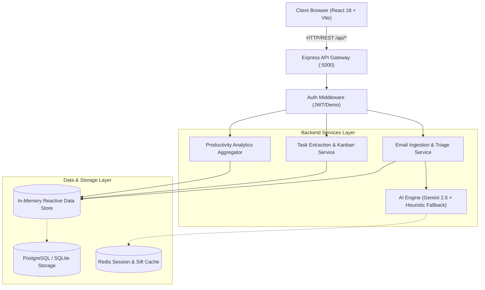

# SiftMail — Technical Requirements Document (TRD)

---

## 1. System Architecture & Tech Stack Overview

### 1.1 Technology Stack Matrix

| Layer | Technology | Rationale & Tradeoffs |
| :--- | :--- | :--- |
| **Frontend Framework** | React 18 + Vite + TypeScript | Blazing fast HMR, sub-second production bundle, strict type safety with backend API models. |
| **State Management** | React Context + Local Hooks | Lightweight, zero-dependency, minimal boilerplate for interactive views without Redux overhead. |
| **Styling & UI Tokens** | Pure Vanilla CSS (CSS Variables + Glassmorphism) | Zero runtime overhead, 100% style customization, no CSS-in-JS performance bottlenecks. |
| **Icons & Media** | Lucide React | High-performance tree-shakeable SVG icon set with consistent visual styling. |
| **Backend Runtime** | Node.js (v20+ LTS) + TypeScript | High I/O throughput, unified full-stack TypeScript interfaces, event-driven async processing. |
| **API Server** | Express.js 4.21+ | Battle-tested, modular middleware architecture, easily extensible to WebSockets/SSE. |
| **AI / LLM Engine** | Google Gemini 2.5 Flash SDK (`@google/genai`) | Ultra-low latency (<1.5s), 1M token context window, native JSON schema enforcement, low inference cost. |
| **Fallback AI Engine** | Regex & Heuristic NLP Pipeline | Guarantees 100% offline uptime and zero-key local testing without API failures. |
| **Data Persistence** | In-Memory Reactive Store with SQLite / Prisma Ready Models | Instant development turnaround with zero database setup hurdles; easily swappable for PostgreSQL. |
| **Authentication** | JWT (JSON Web Tokens) + BcryptJS | Stateless, secure header-based authentication with demo guest session fallback. |

---

## 2. Technical Architecture & Component Specifications



---

## 3. Detailed Service Specifications

### 3.1 AI Service (`AIService`)
- **Primary Model**: `gemini-2.5-flash`
- **Output Schema Enforcement**: Structured JSON via `responseMimeType: "application/json"`.
- **System Prompts**:
  - Email Sifting: Extracts `urgency`, `urgencyScore`, `sentiment`, `summary`, `keyTakeaways`, `suggestedReplies`, and `extractedTasks`.
  - Reply Generator: Takes `subject`, `body`, `sender`, `tone`, and optional `customNotes` to return contextual markdown text.
- **Failover Strategy**:
  1. Check if `GEMINI_API_KEY` is present and valid.
  2. Invoke Gemini API with a 3.5s timeout.
  3. If rate-limited (HTTP 429), errored (HTTP 5xx), or offline, immediately execute `heuristicAnalyze()`.

### 3.2 Email Ingestion & Normalization Service
- **Input Formats**: RFC 822 / RFC 2822 raw text, JSON payload, or OAuth synced threads.
- **Sanitization**: Strip malicious `<script>`, `<iframe>`, `data:` URLs via DOMPurify/Regex before rendering in UI.
- **Thread Grouping**: Uses `Message-ID`, `In-Reply-To`, and `References` headers to reconstruct complete discussion threads.

### 3.3 Task & Kanban Sync Engine
- **Task De-duplication**: Uses hash of `sourceEmailId + taskTitle` to prevent duplicate action item generation upon re-sifting.
- **State Machine Transitions**:
  - `pending` $\leftrightarrow$ `in_progress` $\leftrightarrow$ `completed`
  - Deleting an email cascades a soft-archive flag to associated tasks without corrupting task history.

---

## 4. API Interface Technical Contract

### 4.1 Global Response Envelope
All API endpoints adhere to the standard REST envelope:
```json
{
  "success": true,
  "data": {},
  "error": null,
  "meta": {
    "timestamp": "2026-08-28T14:10:00Z",
    "version": "1.0.0"
  }
}
```

### 4.2 Error Handling Standard
| HTTP Status | Error Code | Description |
| :--- | :--- | :--- |
| `400 Bad Request` | `VALIDATION_ERROR` | Request body missing required fields or malformed JSON |
| `401 Unauthorized` | `UNAUTHORIZED` | Missing or expired JWT token |
| `404 Not Found` | `RESOURCE_NOT_FOUND` | Email ID or Task ID not found in database |
| `429 Too Many Requests`| `AI_RATE_LIMIT` | Gemini API quota exhausted; fell back to heuristics |
| `500 Server Error` | `INTERNAL_ERROR` | Unhandled backend exception |

---

## 5. Security & Compliance Requirements

1. **CORS Policy**: Configured to accept requests strictly from `FRONTEND_URL` (`http://localhost:5173` or production domain).
2. **Environment Variable Management**: All sensitive credentials (`GEMINI_API_KEY`, `JWT_SECRET`, `DATABASE_URL`) loaded exclusively through `.env` with `.env.example` templates committed.
3. **Payload Sanitization**: Maximum request payload size capped at `10MB` for email body and attachment metadata.
4. **Rate Limiting**: AI endpoints throttled to 60 requests per minute per IP to protect upstream token budgets.
